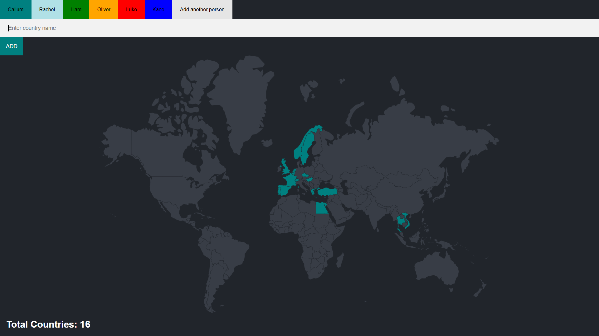

# A multi-person travel tracker
> Keep track of your travels as well as those of your friends and family with this world map travel visualiser

Stores and visualises the countries you and others have been to on a postgres database.

## Getting started

1. Install modules with `npm install`
2. Create a new database and run the commands found in `queries.sql` to get set up
3. Import the list of countries from `countries.csv` to the newly created `countries` table
4. Set up a `.env` file with the following environment variables:
    - [ ] PORT : The port that your express server is going to run on (e.g. 3000)
    - [ ] DB_NAME : The name of your database
    - [ ] DB_HOST : The name of your host (e.g. localhost)
    - [ ] DB_USER : Your database user name (e.g. postgres)
    - [ ] DB_PASSWORD : Your database password
    - [ ] DB_PORT : The port that your database is running on (e.g. 5432)
5. Start the server with `npm start`
6. Now just connect to `localhost:<process.env.PORT>` and get started!

## How to use
1. Add a new user by clicking on the new user button and submitting the 'new user' form
2. Type in the names of any countries you want to attach to that user, and it will automatically display those users
3. By creating multiple users, you can switch between them by clicking on their respective buttons

### Acknowledgements

Thanks to <a href="https://appbrewery.com/">appbrewery</a> and their full-stack web development course for the skeleton of this project from which the functionality was added.
